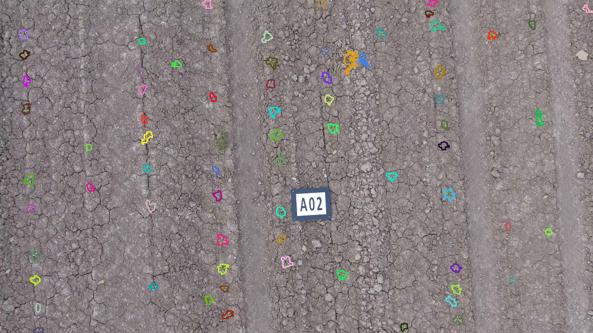

----------
Preface
----------
This is an attempt to count plants on the outdoor testing fields using a hobbyist drone DJI Phantom 4. This application could be useful for seed breeders, chemical industry and farmers.

.. image:: hof.png

----------
Field Setup
----------
For this attempt it is expected that you instrument your field with visual markers. We will use the ones from Zenoway (http://www.bosch-startup.com/platform.html) because of the past affiliation of the author with the mentioned company. However there is plenty of other also open source solutions that can be used instead, e.g. Alvar (http://wiki.ros.org/ar_track_alvar).)

Templates for Zenoway markers (only for Bosch) are available here: https://owncloud.int.bosppaa.com/owncloud/index.php/s/Pnd417eEJcUknH3.

.. image:: dji_sugarbeets_ihingerhof_scaled.png

----------
Calibration
----------
- Fly with the drone (Use DJI Go app) and shoot around 50 pictures of a checkeboard from close (0.5m), far (5m) and in between. Also from different angles.
- Copy images in one folder and use ``image_file_to_ros_topic.cpp`` tool to publishes images as ROS messages. Use ``rosbag record dji_camera/image_raw`` to record a ROS bag file.
- Use https://github.int.bosppaa.com/deepfield/phenotyping/tree/indigo-develop/calibration_tools to calibrate the camera and generate CameraInfo.yaml.
- Run `roslaunch calibration_tools mono_calibrator_17x11x0.042.launch camera:=dji_camera` to start pattern detector.
- Start rqt, load the mono calibrator widget, add 2 image views (one for the raw image topic, one for the pattern detector)
- Play the bag file and use the widget to add detected patterns for the calibrator. When your done click calibrate and commit. In the terminal where you started rqt you will see the printed sensor_msgs::CameraInfo. Copy the values to your yaml files.

----------
Record plant images
----------
Use DJI Go app and record Waypoints, see: http://forum.dji.com/thread-30373-1-1.html. You only need to do this for the first time. Every next time an already recorded track will be available in the history. We experienced that it is best to record 1 waypoint at the beginning and 1 waypoint at the end of the row. We flew with 0.2m/s.

----------
Convert plant images video into ROS bag
----------
- Extract png images from  *.MOV file: ``ffmpeg -i DJI_0003_height_3m.MOV image%06d.png``
- Generate ROS bag with converted images and above obtained CameraInfo. Use ``image_file_to_ros_topic.cpp`` and ``rosbag record dji_camera/image_raw dji_camera/camera_info``.

----------
Localize the drone using visual markers
----------
This part is fully proprietary. Bosch associates can use binaries as explained here (https://github.int.bosppaa.com/deepfield-experimental/low_cost_navigation/issues/22), others please contact Zenoway.

----------
Segment plants and localize them
----------
There are various plant/biomass segmentation algorithms out there. The ones that work best are based on the `NDVI index <https://en.wikipedia.org/wiki/Normalized_Difference_Vegetation_Index>`_ which explore the fact that healthy vegetation absorbs most of the visible light that hits it, and reflects a large portion of the near-infrared light. However since we do not have a near-infrared camera we will work with levels of greeness. To begin with we will implemented simple thresholding in HSV color space: `code <https://github.com/dejanpan/dji_phantom_plant_counting/blob/master/dji_plant_segmentation/src/plant_segmentation.cpp>`_.

Most important parameters:

- `lightness <https://github.com/dejanpan/dji_phantom_plant_counting/blob/master/dji_plant_segmentation/src/plant_segmentation.cpp#L361>`_ - green values are in range of around 159

- plant candidate `min and max size <https://github.com/dejanpan/dji_phantom_plant_counting/blob/master/dji_plant_segmentation/src/plant_segmentation.cpp#L363-L364>`_ - this depends on how high we fly, so treat carefully.

- result images `destination <https://github.com/dejanpan/dji_phantom_plant_counting/blob/master/dji_plant_segmentation/src/plant_segmentation.cpp#L502-L503>`_ - currently hardcode, will be improved later.

How to run the code:

- extract images from *.MOV file as explained in `Convert plant images video into ROS bag`_
- run segmentation as a batch process (replace corresponding hard coded paths): ``for i in /media/pad1pal/data/data/phenotyping/dji_plant_counting/20160629/*.png; do f1=$(cut -c 71- <<< $i); f2=$(cut -c-6 <<< $f1); rosrun dji_plant_segmentation plant_segmentation_node $i $f2 --scanner; done``

The result should like in this `video <https://youtu.be/V8nv7FO7Ve0>`_ or in below screenshot.

----------
Plant matching
----------
