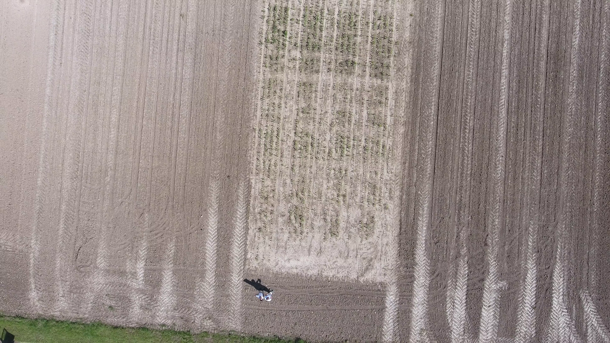
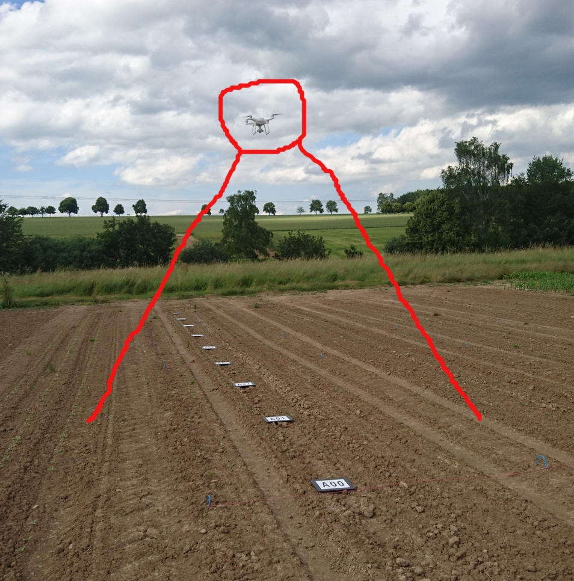

----------
Preface
----------
This is an attempt to count plants on the outdoor testing fields using a hobbyist drone DJI Phantom 4. This application could be useful for seed breeders, chemical industry and farmers.

----------
Field Setup
----------
For this attempt it is expected that you instrument your field with visual markers. We will use the ones from Zenoway (http://www.bosch-startup.com/platform.html) because of the past affiliation of the author with the mentioned company. However there is plenty of other also open source solutions that can be used instead, e.g. Alvar (http://wiki.ros.org/ar_track_alvar).)

Templates for Zenoway markers (only for Bosch) are available here: https://owncloud.int.bosppaa.com/owncloud/index.php/s/Pnd417eEJcUknH3.

----------
Calibration
----------
- Fly with the drone (Use DJI Go app) and shoot around 50 pictures of a checkeboard from close (0.5m), far (5m) and in between. Also from different angles.
- Copy images in one folder and use ``image_file_to_ros_topic.cpp`` tool to publishes images as ROS messages. Use ``rosbag record dji_camera/image_raw`` to record a ROS bag file.
- Use https://github.int.bosppaa.com/deepfield/phenotyping/tree/indigo-develop/calibration_tools to calibrate the camera and generate CameraInfo.yaml.

----------
Record plant images
----------
Use DJI Go app and record Waypoints, see: http://forum.dji.com/thread-30373-1-1.html. You only need to do this for the first time. Every next time an already recorded track will be available in the history. We experienced that it is best to record 1 waypoint at the beginning and 1 waypoint at the end of the row. We flew with 0.2m/s.

----------
Convert plant images video into ROS bag
----------
- Extract png images from  *.MOV file: ``ffmpeg -i DJI_0003_height_3m.MOV image%06d.png``
- Generate ROS bag with converted images and above obtained CameraInfo. Use ``image_file_to_ros_topic.cpp`` and ``rosbag record dji_camera/image_raw dji_camera/camera_info``.

----------
Localize the drone using visual markers
----------
This part is fully proprietary. Bosch associates can use binaries as explained here (https://github.int.bosppaa.com/deepfield-experimental/low_cost_navigation/issues/22), others please contact Zenoway.

----------
Segment plants and localize them
----------

----------
Plant matching
----------
